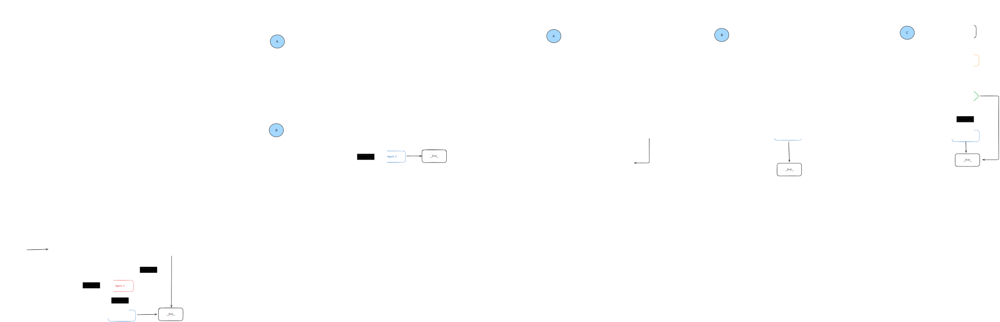

# 🤖 Agent Workflows

A set of **LangGraph** workflow examples — without the clutter.

---

## ✨ Why This Exists

LangGraph can feel daunting when you're new.
This repo attempts to breaks down graph-based thinking into **simple examples** — without the LLMs, Prompt-Templates or Agents.

Each workflow showcases a stripped down **graph patterns**.

---

## 📁 Included Workflows

Each workflow lives in their own source file:

1. **Supervisor Workflow**
   - A central coordinator delegates to other agents and handles results.
2. **Network Workflow**
   - A decentralized setup where nodes interact in a peer-to-peer fashion.
3. **Hierarchical Workflow**
   - A top-down graph and **human-in-the-loop**.
4. **Complex Workflow**



---

## 🛠️ Getting Started

```bash
# 1. Clone the repo
git clone https://github.com/ngendah/agent-workflows.git
cd agent-workflows

# 2. Install dependencies
npm install

# 3. Build the workflows and generate mermaid diagrams
npm run build
```

## 🔗 Further Reference

For official LangGraph documentation visit:
👉 [LangGraph](https://langchain-ai.github.io/langgraphjs/)
